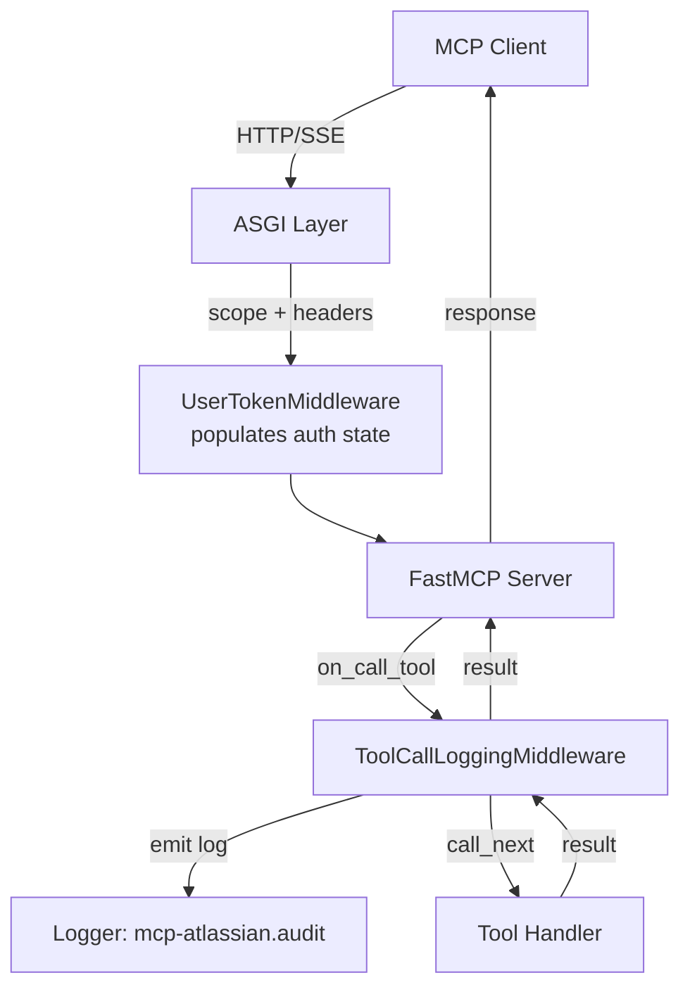

# Design Document: Tool Call Audit Logging

## Overview

This design introduces a `ToolCallLoggingMiddleware` that leverages FastMCP's built-in middleware system to emit structured audit log entries for every tool invocation. The middleware subclasses `fastmcp.server.middleware.Middleware` and overrides only the `on_call_tool` hook, keeping it focused and non-intrusive.

Each audit log entry follows the format:
```
<source_ip> <tool_name> <username> <request_body_json>
```

The middleware is registered on the `AtlassianMCP` server instance via `add_middleware()` during server construction, gated by the `MCP_AUDIT_LOG_ENABLED` environment variable (enabled by default).

**Key design decisions:**
- Uses FastMCP's `Middleware` base class and `on_call_tool` hook rather than ASGI-level middleware, keeping audit logging at the MCP protocol layer where tool names and arguments are already parsed.
- Emits to a dedicated `mcp-atlassian.audit` logger so operators can route audit logs independently of application logs.
- Reuses the existing `mask_sensitive` utility for credential masking, maintaining consistency with the rest of the codebase.
- Extracts request context (IP, username) from the ASGI scope and request state already populated by `UserTokenMiddleware`.

## Architecture



**Middleware pipeline position:**

```
Request → UserTokenMiddleware (ASGI) → FastMCP → ToolCallLoggingMiddleware (on_call_tool) → Tool Handler
```

The `ToolCallLoggingMiddleware` operates at the FastMCP middleware layer (not ASGI), which means it has access to parsed tool names and arguments via `context.message`. It relies on the upstream `UserTokenMiddleware` (ASGI layer) having already populated the request state with authentication details.

## Components and Interfaces

### ToolCallLoggingMiddleware

**Location:** `src/mcp_atlassian/servers/audit.py`

```python
from fastmcp.server.middleware import Middleware, MiddlewareContext

class ToolCallLoggingMiddleware(Middleware):
    """Audit logging middleware for MCP tool calls.

    Intercepts tool invocations via the on_call_tool hook and emits
    structured audit log entries before delegating to the next handler.
    """

    def __init__(
        self,
        sensitive_patterns: list[str] | None = None,
        max_body_length: int = 2048,
    ) -> None: ...

    async def on_call_tool(
        self, context: MiddlewareContext, call_next
    ): ...
```

**Internal helper methods:**

| Method | Purpose |
|--------|---------|
| `_extract_source_ip(context)` | Gets client IP from ASGI scope or X-Forwarded-For header |
| `_extract_username(context)` | Gets username from request state based on auth type |
| `_mask_arguments(arguments)` | Deep-masks sensitive fields in tool arguments (1 level) |
| `_serialize_body(arguments)` | JSON-serializes and truncates the masked arguments |

### Registration Logic

**Location:** `src/mcp_atlassian/servers/main.py` (in `create_main_mcp()` or equivalent server construction)

```python
from mcp_atlassian.servers.audit import create_audit_middleware

# During server construction:
audit_mw = create_audit_middleware()
if audit_mw is not None:
    mcp.add_middleware(audit_mw)
```

**Factory function:**

```python
def create_audit_middleware() -> ToolCallLoggingMiddleware | None:
    """Create audit middleware if enabled by configuration.

    Returns None if MCP_AUDIT_LOG_ENABLED is set to a falsy value.
    """
```

This factory reads environment variables and returns `None` when audit logging is disabled, keeping the conditional logic out of the server construction code.

### Configuration Interface

| Environment Variable | Type | Default | Description |
|---------------------|------|---------|-------------|
| `MCP_AUDIT_LOG_ENABLED` | bool-like | `true` (enabled) | Enable/disable audit middleware registration |
| `MCP_AUDIT_SENSITIVE_FIELDS` | comma-separated | (none) | Additional field name substrings to mask |
| `MCP_AUDIT_MAX_BODY_LENGTH` | int ≥ 64 | `2048` | Max characters for serialized request body |

### Integration with Existing Components

| Component | Interaction |
|-----------|-------------|
| `UserTokenMiddleware` | Provides `user_atlassian_auth_type`, `user_atlassian_email` in request state |
| `mask_sensitive` utility | Reused for value masking |
| `is_env_truthy` utility | NOT reused — audit uses inverse logic (enabled by default, disabled on falsy) |
| `AtlassianMCP.http_app()` | Unchanged — audit middleware is added via `add_middleware()` at the FastMCP layer |

## Data Models

### Audit Log Entry (Logical Structure)

The audit log entry is not a Pydantic model — it's a formatted log string. The logical fields are:

| Field | Type | Source | Example |
|-------|------|--------|---------|
| `source_ip` | `str` | ASGI scope `client[0]` or `X-Forwarded-For` | `192.168.1.100` |
| `tool_name` | `str` | `context.message.name` | `jira_get_issue` |
| `username` | `str` | Request state auth fields | `user@example.com` |
| `request_body` | `str` | JSON-serialized masked arguments | `{"issue_key": "PROJ-123"}` |

### Sensitive Field Patterns

Default patterns (case-insensitive substring match):
```python
DEFAULT_SENSITIVE_PATTERNS: list[str] = [
    "token", "password", "secret", "key", "credential", "auth"
]
```

Custom patterns are added via `MCP_AUDIT_SENSITIVE_FIELDS` (comma-separated). If the environment variable contains malformed data that cannot be parsed as a comma-separated list, the additional patterns are skipped entirely and only the default patterns above are used.

### Masking Behavior

For a tool call with arguments:
```python
{"issue_key": "PROJ-123", "api_token": "ghp_abc123xyz", "metadata": {"secret_key": "s3cr3t"}}
```

After masking (1 level deep):
```python
{"issue_key": "PROJ-123", "api_token": "ghp_****xyz", "metadata": {"secret_key": "s3cr****3t"}}
```

### Truncation Behavior

The truncation threshold applies to the **original request body content length before JSON serialization**. The process is:

1. Compute the string representation of the original arguments (before JSON serialization)
2. Measure the character length of that content
3. If the original content length exceeds the configured threshold (default 2048), truncate the serialized output to the threshold length and append `...truncated`
4. If within the threshold, emit the full JSON-serialized body

### Username Resolution

| Auth Type | Primary Source | Fallback |
|-----------|---------------|----------|
| Basic | Email from decoded `Authorization` header (portion before first `:`) | `"anonymous"` (when no `Authorization` header present) |
| PAT | `user_atlassian_email` from request state | `"pat-user"` |
| OAuth | `user_atlassian_email` from request state | `"oauth-user"` |
| None (no `user_atlassian_auth_type`) | — | `"anonymous"` |

## Documentation

### Files to Update

| File | Change |
|------|--------|
| `README.md` | Add "Audit Logging" section describing the feature, log format, and configuration |
| `.env.example` | Add commented-out `MCP_AUDIT_LOG_ENABLED`, `MCP_AUDIT_SENSITIVE_FIELDS`, `MCP_AUDIT_MAX_BODY_LENGTH` with descriptions |

### README Audit Logging Section Content

The documentation section must include:
1. **Feature overview** — purpose and log entry format (`<source_ip> <tool_name> <username> <request_body>`)
2. **Environment variables table** — all three audit env vars with types, defaults, and descriptions
3. **Sensitive field patterns** — list of default patterns (`token`, `password`, `secret`, `key`, `credential`, `auth`) and instructions for adding custom patterns via `MCP_AUDIT_SENSITIVE_FIELDS`
4. **Username resolution** — explanation of how the username field is populated for each auth method (Basic, PAT, OAuth) and the fallback values (`anonymous`, `pat-user`, `oauth-user`)

### .env.example Additions

```bash
# Audit Logging
# MCP_AUDIT_LOG_ENABLED=true          # Enable/disable tool call audit logging (default: true)
# MCP_AUDIT_SENSITIVE_FIELDS=          # Additional comma-separated field name patterns to mask
# MCP_AUDIT_MAX_BODY_LENGTH=2048       # Max request body length before truncation (min: 64)
```

## Correctness Properties

*A property is a characteristic or behavior that should hold true across all valid executions of a system — essentially, a formal statement about what the system should do. Properties serve as the bridge between human-readable specifications and machine-verifiable correctness guarantees.*

### Property 1: Configuration gating

*For any* value of the `MCP_AUDIT_LOG_ENABLED` environment variable, the factory function SHALL return a middleware instance if and only if the value is unset or is a truthy string (case-insensitive `true`, `1`, `yes`); for any falsy string (case-insensitive `false`, `0`, `no`) it SHALL return `None`.

**Validates: Requirements 1.4, 7.1**

### Property 2: Source IP extraction

*For any* ASGI connection scope and set of request headers, the extracted source IP SHALL equal: the first comma-separated entry in `X-Forwarded-For` (if present), otherwise the first element of the scope `client` tuple (if present), otherwise `"unknown"` — with all leading and trailing whitespace stripped from the result.

**Validates: Requirements 2.1, 2.2, 2.3, 2.4**

### Property 3: Username extraction

*For any* request state containing a `user_atlassian_auth_type` and associated email fields, the extracted username SHALL equal: the `user_atlassian_email` value when it is non-empty (for Basic, PAT, or OAuth auth types), otherwise the appropriate fallback string (`"anonymous"` for Basic with no Authorization header, `"pat-user"` for PAT, `"oauth-user"` for OAuth, or `"anonymous"` when no auth type is set).

**Validates: Requirements 3.1, 3.2, 3.3, 3.4, 3.5**

### Property 4: Sensitive field masking

*For any* tool call argument dictionary and any set of sensitive field patterns (default + custom), every argument whose name contains a pattern substring (case-insensitive) SHALL have its value replaced by the output of `mask_sensitive(str(value))`, and non-matching arguments SHALL remain unchanged.

**Validates: Requirements 4.1, 4.2, 4.3, 4.4**

### Property 5: Depth-limited nested masking

*For any* tool call argument that is a dictionary and whose key does NOT match a sensitive pattern, the middleware SHALL inspect the nested dictionary's keys and mask values whose keys match a sensitive pattern — but SHALL NOT recurse beyond one additional level of depth.

**Validates: Requirements 4.5, 4.6**

### Property 6: Log format and single-line serialization

*For any* valid combination of source IP, tool name, username, and arguments, the emitted audit log message SHALL match the pattern `<ip> <tool_name> <username> <json_body>` where `<json_body>` is a single-line JSON string containing no embedded newline or control characters.

**Validates: Requirements 5.1, 5.4**

### Property 7: Body truncation

*For any* tool call arguments and configured max body length (≥ 64), if the original content length of the arguments (measured before JSON serialization) exceeds the threshold, the serialized body SHALL be truncated to exactly that many characters with `...truncated` appended; if the original content length does not exceed the threshold, the body SHALL be emitted in full. Invalid threshold values (non-integer or < 64) SHALL result in the default 2048 being used.

**Validates: Requirements 5.5, 7.3, 7.4**

### Property 8: Transparent delegation

*For any* tool call processed by the middleware, the downstream handler SHALL be invoked with the exact same arguments that were passed to the middleware (unmodified), and any exception raised by the downstream handler SHALL propagate unchanged through the middleware.

**Validates: Requirements 6.1, 6.2, 6.3**

### Property 9: Graceful degradation on logging failure

*For any* tool call where the audit logging operation itself raises an exception, the middleware SHALL emit a WARNING-level log entry about the logging failure and ensure that warning is successfully written BEFORE delegating to the downstream handler; the middleware SHALL only emit warnings when audit logging actually fails with an exception and SHALL NOT log warnings during normal successful operation.

**Validates: Requirements 6.4**

### Property 10: Sensitive fields environment variable parsing

*For any* value of `MCP_AUDIT_SENSITIVE_FIELDS`, the middleware SHALL parse it as a comma-separated list, trim whitespace from each entry, discard empty entries, and use the resulting strings as additional case-insensitive substring patterns for masking. If the value contains malformed data that cannot be parsed as a comma-separated list, the middleware SHALL skip the additional patterns entirely and use only the default sensitive field patterns.

**Validates: Requirements 4.4, 7.2**

### Property 11: Documentation completeness

*For any* deployment of this feature, the project README SHALL contain a section documenting the audit logging feature including: the log entry format, all three environment variables with types/defaults/descriptions, the default sensitive field patterns with customization instructions, and username resolution logic for each auth method with fallback values. The `.env.example` file SHALL contain commented-out entries for all audit environment variables.

**Validates: Requirements 8.1, 8.2, 8.3, 8.4, 8.5**

## Error Handling

| Scenario | Behavior |
|----------|----------|
| Audit logging raises an exception (e.g., logger misconfigured, serialization error) | Log at WARNING level to the application logger (`mcp-atlassian`), ensure warning is written, then proceed with tool execution |
| ASGI scope missing `client` tuple | Fall back to `X-Forwarded-For`, then to `"unknown"` |
| Request state missing auth fields | Use `"anonymous"` as username |
| Basic auth with no `Authorization` header present | Use `"anonymous"` as username |
| `MCP_AUDIT_MAX_BODY_LENGTH` set to invalid value | Ignore, use default 2048 |
| `MCP_AUDIT_SENSITIVE_FIELDS` contains malformed data | Skip additional patterns, use only default sensitive field patterns |
| Tool arguments contain non-serializable values | Use `repr()` fallback in JSON serialization with `default=repr` |
| `mask_sensitive` receives `None` | Returns `"Not Provided"` (existing behavior) |

**Design principle:** The audit middleware must never prevent tool execution. All internal errors are caught, a WARNING is logged and confirmed written, then `call_next(context)` is invoked. Warnings are only emitted when audit logging actually fails — not during normal successful operation.

## Testing Strategy

### Property-Based Testing

**Library:** [Hypothesis](https://hypothesis.readthedocs.io/) (Python PBT library)

**Configuration:** Minimum 100 examples per property test.

**Tag format:** `Feature: tool-call-audit-logging, Property {N}: {title}`

Each correctness property (1–10) maps to a single Hypothesis property test. The tests will use:
- `@given` decorators with custom strategies for generating:
  - IP addresses (valid IPv4/IPv6 strings with optional whitespace)
  - Tool argument dictionaries with mixed sensitive/non-sensitive field names
  - Comma-separated environment variable strings (including malformed values)
  - Auth state dictionaries with various auth types
- `@settings(max_examples=100)` minimum

Property 11 (documentation completeness) is validated via smoke tests rather than PBT since it checks static file content.

### Unit Tests (Example-Based)

| Test | Validates |
|------|-----------|
| Middleware subclasses `fastmcp.server.middleware.Middleware` | Req 1.2 |
| Only `on_call_tool` is overridden | Req 1.3 |
| Log level is INFO | Req 5.2 |
| Logger name is `mcp-atlassian.audit` | Req 5.3 |
| Empty arguments produce `{}` | Req 5.6 |
| No network calls in middleware (no httpx/requests usage) | Req 3.6 |
| Middleware enabled by default (env unset) | Req 1.4 |
| Warning only emitted on actual failure, not on success | Req 6.4 |
| Malformed `MCP_AUDIT_SENSITIVE_FIELDS` falls back to defaults only | Req 4.4 |

### Integration Tests

| Test | Validates |
|------|-----------|
| End-to-end: tool call through FastMCP server produces audit log entry | Reqs 1.1, 5.1, 6.1 |
| Middleware registered before first tool call in server lifecycle | Req 1.1 |

### Smoke Tests (Documentation)

| Test | Validates |
|------|-----------|
| README contains audit logging section with feature description | Req 8.1 |
| README lists all three audit environment variables | Req 8.2 |
| `.env.example` contains audit environment variables | Req 8.3 |
| README describes default sensitive field patterns | Req 8.4 |
| README explains username resolution for each auth method | Req 8.5 |

### Test File Location

```
tests/unit/servers/test_audit.py
```

### Dependencies

Add `hypothesis` to the dev dependency group in `pyproject.toml`:
```toml
[dependency-groups]
dev = [
    ...
    "hypothesis>=6.0.0",
]
```
